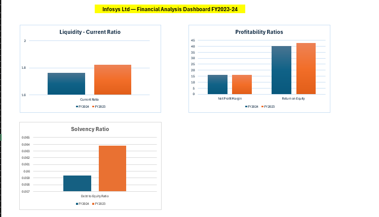

# Infosys Financial Statement Analysis

Ratio analysis (liquidity, profitability, solvency) of Infosys FY2023-24 
financials, built in Excel with an interactive dashboard.

## Tools
Excel — Pivot Tables, Ratio Analysis, Dashboard Design

## Key Insights
1. Profitability is steady, but shareholder returns have softened — ROE fell 6.5% YoY despite a flat net margin.
2. Balance sheet is getting more conservative — debt-to-equity dropped to 0.06, reflecting minimal leverage.

## Dashboard Preview

